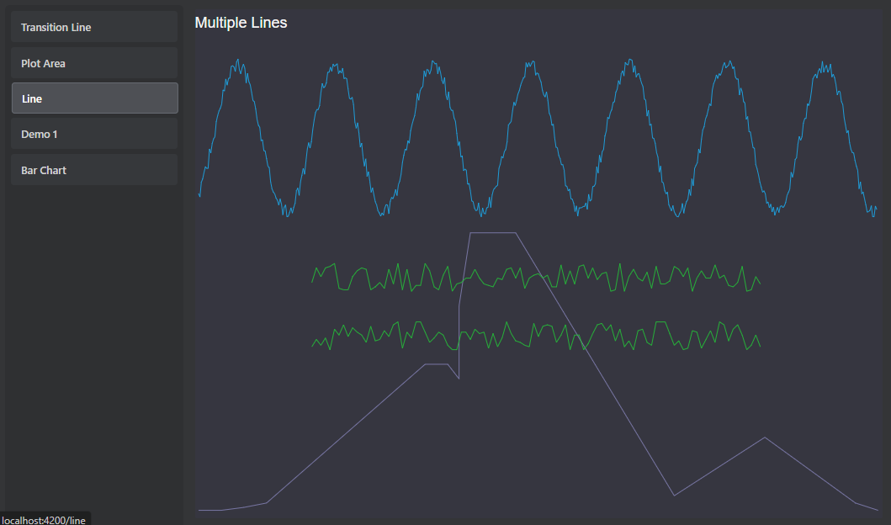
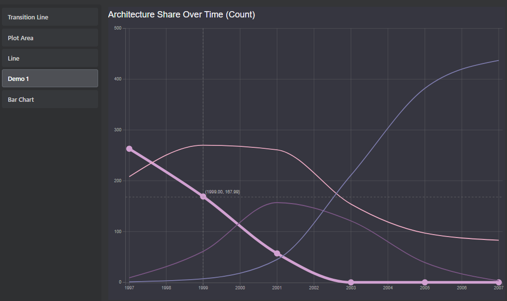
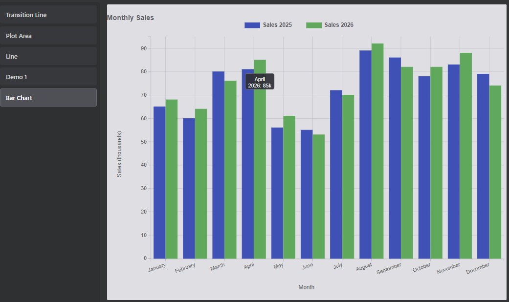

# d3-plot

An Angular playground for building reusable D3 chart primitives and interactive plot demos.

This workspace uses the Plot architecture for all active chart development.

### Examples





## Plot architecture

- Explicit area model (`PlotArea`): top, left, right, bottom, center each own rect, scale, and child items.
- Composition is item-based (`PlotItem`) with clear lifecycle (`initializeLayout` / `updateLayout`).
- Modular interaction model (scale handling, mouse handlers, cursor and selection behaviors).
- Reusable chart elements (axis/grid, line series, title) with configurable options.

## Direction

- **Use Plot only for new work.**
- Active demos in the app route/tab shell target the current components under `src/components`.

## Tech stack

- Angular 20 (standalone components)
- TypeScript
- D3 v7
- Jest (unit tests for plot utilities and plot behavior)

## Project layout

- `src/components/*`: Angular demo components using Plot.
- `src/plot/*`: Plot engine, areas, elements, scaling, and mouse handling.
- `src/plot/util/*`: shared geometry/util helpers and tests.
- `src/app/*`: application shell that hosts demos.

## Getting started

Install dependencies:

```bash
npm install
```

Run the app locally:

```bash
npm start
```

Then open `http://localhost:4200`.

## Testing

Run unit tests:

```bash
npm test
```

## Notes

- D3 rendering is encapsulated in plot base components that attach SVG output to a container and react to window resize.
- Demo components now use Angular signals for plot bindings passed into base components.