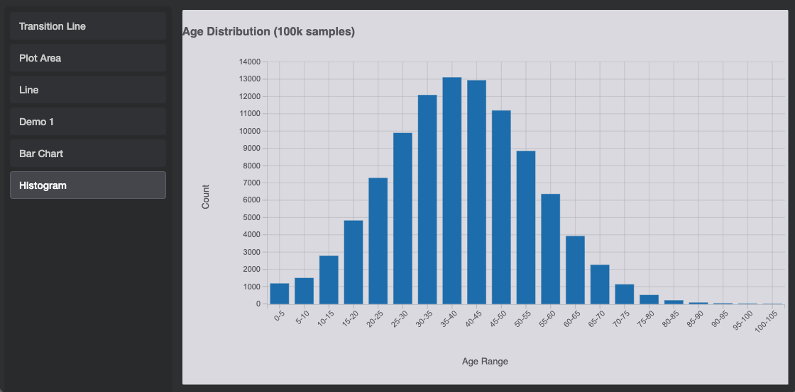

## What is Plot?

[D3.js](https://d3js.org/) is a chart framework for building interactive, composable visualizations with Angular.  

Plot is a structured wrapper around [D3.js](https://d3js.org/) that provides:

- **Layout system** - Divide charts into logical areas (top, left, center, right, bottom)
- **Composable items** - Create custom visualizations as `PlotItem` classes with lifecycle hooks
- **Full D3 access** - No limitations; use any D3 feature you need
- **Built-in scaling** - Automatic coordinate mapping with configurable domains
- **Reusable elements** - Pre-built items for axes, lines, bars, tooltips, and more

### Examples




## Learn More

For a detailed guide on the architecture and how to build custom charts, see [Plot Architecture](src/plot/doc/README.md).

## Tech Stack

- Angular 20 (standalone components)
- TypeScript
- D3 v7
- Jest (unit tests for plot utilities and plot behavior)

## Getting Started

Install dependencies:

```bash
npm install
```

### Generate age histogram data

The project includes a Python script to generate age distribution samples for the histogram chart:

```bash
# Create and activate Python virtual environment
python3 -m venv .venv
source .venv/bin/activate  # On Windows: .venv\Scripts\activate

# Install Python dependencies
pip install -r requirements.txt

# Generate age histogram data (outputs to age_data_bins.ts)
python3 src/python/age_histogram.py
```

Run the app locally:

```bash
npm start
```

Then open `http://localhost:4200`.

## Testing

Run unit tests:

```bash
npm test
```

## Notes

- D3 rendering is encapsulated in plot base components that attach SVG output to a container and react to window resize.
